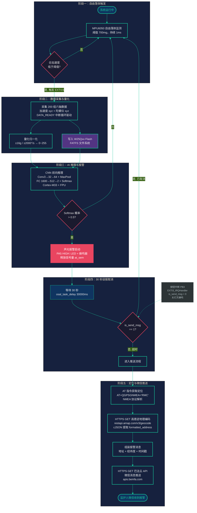

# 跌倒检测→紧急推送 功能流程图



## 图片生成方式

### 方案 A：在线编辑器（推荐，无需安装）

1. 打开浏览器访问 **[Mermaid Live Editor](https://mermaid.live)**
2. 将上方 `flowchart TB ...` 代码块内的内容完整粘贴到编辑器左侧输入区（不含 3 个反引号的行）
3. 右侧将实时预览流程图效果
4. 点击顶部工具栏 **"Actions"** → 选择 **"Export as PNG"** 或 **"Export as SVG"**
5. 调整导出分辨率建议：**宽度 2400px**，**缩放 2x**（保证论文 300dpi 印刷效果）

> **注意**：Mermaid Live 导出 PNG 时，请在弹出的设置框中设置 `scale` 为 `2` 或 `3`，以获得高清图片。

### 方案 B：命令行工具（适合批量生成）

```bash
# 安装 mermaid-cli
npm install -g @mermaid-js/mermaid-cli

# 从当前 .md 文件生成 PNG
mmdc -i fall_detection_flowchart.md -o fall_detection_flowchart.png \
     -w 2400 -H 3600 --scale 2 \
     -p /dev/null \
     --backgroundColor "#1a1a2e"

# 如需 SVG（矢量，缩放不失真）
mmdc -i fall_detection_flowchart.md -o fall_detection_flowchart.svg -w 2400
```

> `-w/--width` 和 `-H/--height` 控制输出画布大小，`--scale` 为 2x 超采样。

### 方案 C：VS Code 插件

1. 安装插件 **"Markdown Preview Mermaid Support"**（作者：bierner）
2. 在当前 `.md` 文件的 Mermaid 代码块上，按 `Ctrl+Shift+P`
3. 选择 **"Markdown: Open Preview to the Side"** 查看预览
4. 右键预览区 → **Save Image As...** 导出 PNG

> **推荐组合**：开发调试使用 VS Code 插件预览 → 最终交付使用 **方案 A**（Mermaid Live）导出高分辨率 PNG。

---

## 流程图节点说明

| 阶段 | 节点 | 说明 | 对应源代码 |
|------|------|------|-----------|
| **阶段一：自由落体触发** | MPU6050 监测 → 硬件中断 | MPU6050 内部 DSP 实时计算合加速度，低于 700mg 持续 1ms 时 INT 引脚输出低电平，触发 STM32 EXTI15 中断。`exit_callback` 在 ISR 上下文释放 `mpu_sem` 唤醒 MPU 线程 | `mpu6050_wrap.c:126` INT_STATUS bit7 判定 |
| **阶段二：数据采集与量化** | 200 组 6 轴采集 → Flash 写入 + 量化归一化 | MPU 线程检测 FREE_FALL 位后，关闭 FREE 中断、使能 DATA_READY 中断。每收到一次 EXTI15 中断读取 1 组六轴数据，循环 200 次。满后关闭中断、写入 Flash、量化数据至 `net_data[200][6]`，最后释放 `ai_sem` 唤醒 AI 线程 | `mpu6050_wrap.c:135-158`（采集循环 + 满缓冲处理） |
| **阶段三：AI 推理与报警** | CNN 推理 → Softmax 判定 | AI 线程从 `ai_sem` 唤醒后，调用 FD-CNN 网络前向推理。`post_process` 计算 Softmax 概率，`prob_fall > 0.5` 即判定跌倒。若跌倒：`is_send_msg=1`，PA5 输出 HIGH 开启 LED+蜂鸣器，释放 `at_sem` 唤醒 AT 线程 | `ai_task.c:22-29`（判决 + 报警）；`app_x-cube-ai.c:221`（prob_fall 阈值） |
| **阶段四：30 秒误报取消** | 30 秒延迟 → 按键作废检查 | AT 线程从 `at_sem` 唤醒后立即执行 `osal_task_delay(30000)` 等待 30 秒。期间若用户按下 PB3 按钮，`EXTI3_IRQHandler` 异步执行 `is_send_msg=0` 并关闭 LED/蜂鸣器。30 秒后检查 `is_send_msg`：0 表示已取消，复位标志并回到等待状态；1 表示超时未取消，进入推送流程 | `at_task.c:233-234`（延迟 + 检查）；`platform_gpio_driver.c:119`（EXTI3 ISR） |
| **阶段五：定位与微信推送** | AT GPS → 高德逆地理编码 → 巴法云推送 | `at_get_location()` 发送 AT+QGPSGNMEA='RMC' 并手写 NMEA 解析器提取十进制度经纬度。`query_geocode()` 通过 HTTPS GET 调用高德逆地理编码 API（`restapi.amap.com`），cJSON 解析返回的 `formatted_address`。组装"地址+经纬度+时间戳"消息后，通过 HTTPS GET 巴法云 API 推送到监护人微信 | `at_command.c:727`（GPS+NMEA）；`at_task.c:157`（地理编码）；`at_command.c:1115`（巴法云推送） |
