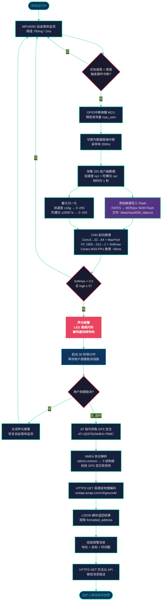

# 跌倒检测→紧急推送 功能流程图



## 图片生成方式

### 方案 A：在线编辑器（推荐，无需安装）

1. 打开浏览器访问 **[Mermaid Live Editor](https://mermaid.live)**
2. 将上方 `flowchart TD ...` 代码块内的内容完整粘贴到编辑器左侧输入区（不含 3 个反引号的行）
3. 右侧将实时预览流程图效果
4. 点击顶部工具栏 **"Actions"** → 选择 **"Export as PNG"** 或 **"Export as SVG"**
5. 调整导出分辨率建议：**宽度 2400px**，**缩放 2x**（保证论文 300dpi 印刷效果）

> **注意**：Mermaid Live 导出 PNG 时，请在弹出的设置框中设置 `scale` 为 `2` 或 `3`，以获得高清图片。

### 方案 B：命令行工具（适合批量生成）

```bash
# 安装 mermaid-cli
npm install -g @mermaid-js/mermaid-cli

# 从当前 .md 文件生成 PNG
mmdc -i fall_detection_flowchart.md -o fall_detection_flowchart.png \
     -w 2400 -H 3600 --scale 2 \
     -p /dev/null \
     --backgroundColor "#1a1a2e"

# 如需 SVG（矢量，缩放不失真）
mmdc -i fall_detection_flowchart.md -o fall_detection_flowchart.svg -w 2400
```

> `-w/--width` 和 `-H/--height` 控制输出画布大小，`--scale` 为 2x 超采样。

### 方案 C：VS Code 插件

1. 安装插件 **"Markdown Preview Mermaid Support"**（作者：bierner）
2. 在当前 `.md` 文件的 Mermaid 代码块上，按 `Ctrl+Shift+P`
3. 选择 **"Markdown: Open Preview to the Side"** 查看预览
4. 右键预览区 → **Save Image As...** 导出 PNG

> **推荐组合**：开发调试使用 VS Code 插件预览 → 最终交付使用 **方案 A**（Mermaid Live）导出高分辨率 PNG。

---

## 流程图节点说明

| 阶段 | 节点 | 说明 |
|------|------|------|
| **阶段一：自由落体触发** | MPU6050 监测 → 硬件中断 | MPU6050 内部 DSP 实时计算合加速度，低于 700mg 持续 1ms 时触发 INT 引脚。中断信号无需软件参与，响应延迟 <1μs |
| **阶段二：数据采集与持久化** | 200 组 6 轴采集 → Flash 写入 + 量化归一化 | 切换为数据就绪中断，以 200Hz 采集 1 秒共 200 组数据。两条并行路径：原始数据写入 W25Qxx NOR Flash 供事后分析，量化数据拷贝至 `net_data[200][6]` 供 AI 输入 |
| **阶段三：AI 推理判决** | CNN 推理 → 双重阈值判定 | 量化数据送入五层 CNN（Conv→Pool→FC→Softmax），双重阈值策略判决：Softmax 概率 > 0.5 且 logit ≥ 5 方确认跌倒，否则返回监测 |
| **阶段四：声光报警** | LED + 蜂鸣器 | 确认跌倒后立即激活板载 LED 高频闪烁和蜂鸣器持续鸣响，提示事故现场周边人员 |
| **阶段五：误报取消** | 30 秒倒计时 | 给予用户 30 秒按键取消窗口。已取消则关闭警报、复位状态；超时未取消则进入紧急推送流程 |
| **阶段六：定位与地址解析** | GPS → NMEA → 高德 API → cJSON | AT 指令获取 RMC 定位语句 → 手写 NMEA 解析器提取经纬度 → HTTPS GET 调用高德逆地理编码 API → cJSON 解析街道级地址 |
| **阶段七：消息推送** | 巴法云 → 微信 | 组装地址+坐标+时间戳信息 → HTTPS GET 巴法云 IoT 平台 → 推送至监护人微信客户端 |
