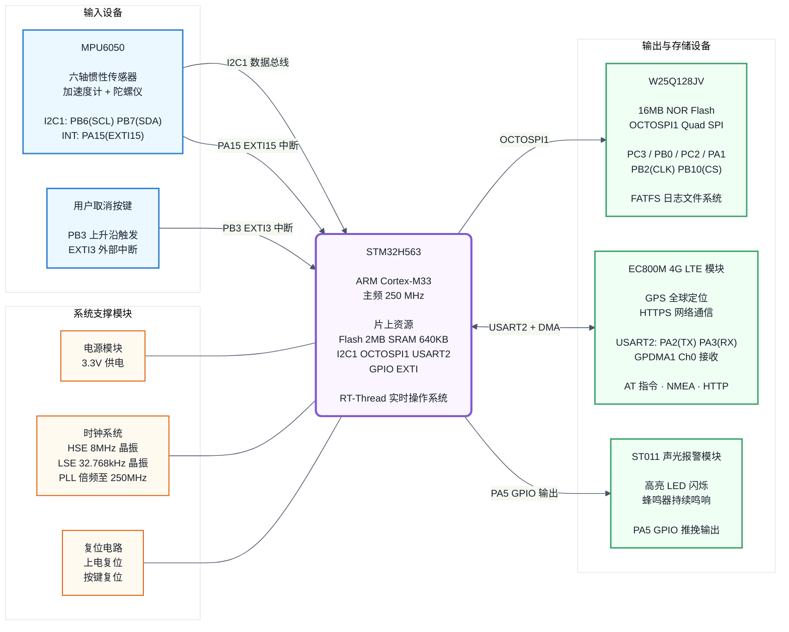

# 系统硬件框图



## 硬件连接总表

| 组件 | 型号 | 接口 | MCU 引脚 | 功能 |
|------|------|------|----------|------|
| **六轴传感器** | MPU6050 | I2C1 (400kHz) | PB6(SCL), PB7(SDA) | 加速度 + 陀螺仪数据采集 |
|  |  | EXTI15 (下降沿) | PA15(INT) | 自由落体硬件中断唤醒 |
| **按键** | 轻触开关 | EXTI3 (上升沿) | PB3 | 30 秒内用户取消报警 |
| **MCU** | STM32H563 | — | — | Cortex-M33 @ 250MHz，运行 RT-Thread |
| **NOR Flash** | W25Q128JV | OCTOSPI1 (Quad SPI) | PC3(IO0), PB0(IO1), PC2(IO2), PA1(IO3), PB2(CLK), PB10(CS) | FATFS 文件系统，原始数据持久化存储 |
| **4G 通信模块** | EC800M | USART2 (115200bps) | PA2(TX), PA3(RX) | AT 指令控制、GPS NMEA 解析、HTTPS 网络请求 |
|  |  | GPDMA1 Ch0 | — | DMA 循环接收 + IDLE 中断 |
| **声光报警模块** | ST011 | GPIO 推挽输出 | PA5 | LED 闪烁 + 蜂鸣器鸣响 |
| **电源模块** | — | VDD 3.3V / VDDA | — | 主电源 + 模拟电源 |
| **时钟系统** | 8MHz / 32.768kHz | HSE / LSE | PH0, PH1 | PLL ×250/4/2 → 250MHz SYSCLK |

### 系统运行参数

| 参数 | 值 |
|------|-----|
| 主频 | 250 MHz (HSE 8MHz → PLL ×250/4/2) |
| I2C1 | 400 kHz (Fast Mode) |
| OCTOSPI1 | 125 MHz (PLL1Q = 125MHz, prescaler 1) |
| USART2 | 115200 bps, 8N1, DMA RX |
| 工作电压 | 3.3V |
| Flash 容量 | 2MB (片上) + 16MB (外部 W25Q128JV) |
| SRAM | 640KB |

---

## 图片生成方式

### 方案 A：在线编辑器（推荐）

1. 打开 **[Mermaid Live Editor](https://mermaid.live)**
2. 将上方 `flowchart LR ...` 代码块内容粘贴到编辑器左侧
3. 右侧实时预览
4. 点击 **Actions → Export as SVG**（矢量格式，缩印不失真）

### 方案 B：命令行

```bash
npm install -g @mermaid-js/mermaid-cli
mmdc -i hardware_block_diagram.md -o hardware_block_diagram.svg -w 2400
```

### 方案 C：VS Code

1. 安装插件 **Markdown Preview Mermaid Support**
2. 在 mermaid 代码块上 `Ctrl+Shift+P` → **Markdown: Open Preview to the Side**
3. 右键预览区 → Save Image As...
